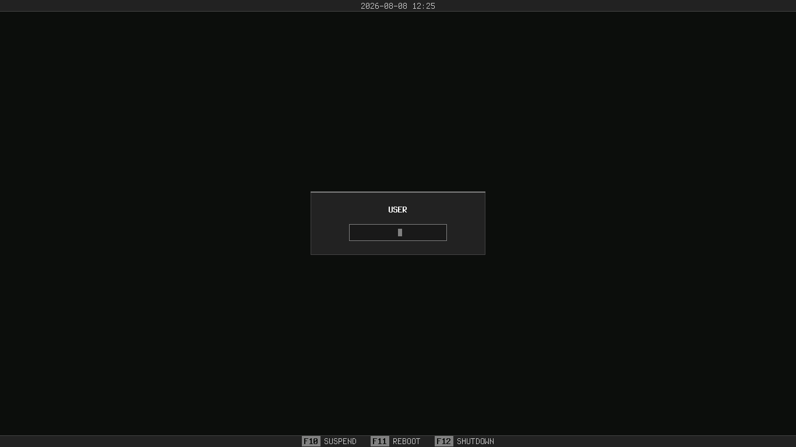

# slgreet

<center>slgreet (suckless greet) is a customized sddm greeter that is designed for dwm (dynamic window manager).</center>



dependencies needed:
``` sddm qt5-declarative ```

to install:
``` cp */your/theme/directory* /usr/share/sddm/themes/ ```

this theme is customizable, you can customize the colors and change the background wallpaper inside the ```theme.conf```

<small>© 2026 Izflir. All rights reserved.</small>
